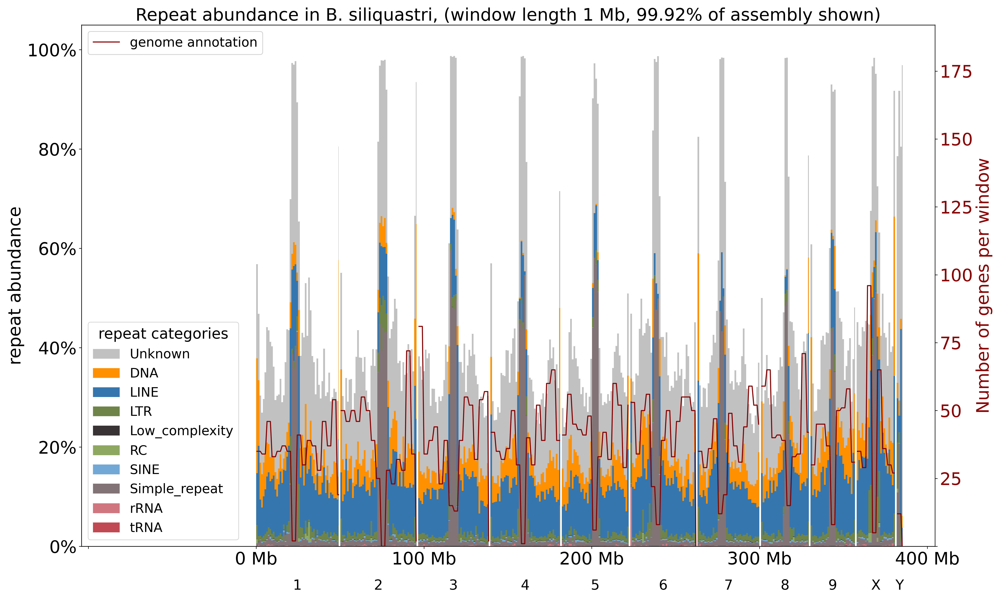

# ReVis

Visualize the repeat content across a genome in a stacked histogram of the different repeat categories. The repeat content is shown in non-overlapping windows, and optionally a line of the gene numbers (mean over multiple windows) can be included.
 

# Quick start

python3 ReVis.py --masker_outfile your_assembly.fna.ori.out --masker_out_gff your_assembly.fna.out.gff --species_name Your_species --window_length 1e6 --plot_overlap_filtered --verbose --plot

# Documentation

download the latest release and just run `ReVis.py` like a normal python script. The dependencies are listed in `requirements.txt`, they are only commonly used python packages and can be installed with pip. 

The script is using the output files generated by repeatmasker, the masked assembly, and optionally one or two genome annotations based on the same assembly (contig names have to match!). Results can be plotted in a stacked histogram (plot mode) or returned as tsv files (table mode, requires the annotation!). 

Repeatmasker allows overlapping repeat annotations, which can result in a repeat percentage ov over 100% in any window. For plotting purposes, I have implemented a method of removing these overlaps. The overlap is filtered by cutting the beginning of the current repeat based on the end of the previous one. Below is a quick example of two repeat categories `-` and `*` that overlap in their annotated position, and how my script handles these overlaps

```
unfiltered overlapping repeats
--------------------        ----------------                                     -------------              
            *************************************               *************************

filtered repeats that do not overlap any more
--------------------*****************************               *************************-----
```

(completely inserted repeats vanish this way, but the overall bases covered by repeats stays similar. Repeats completely inserted into other repeats that span a wider region are filtered out completely)


## Dependencies

 *  On uppmax, load biopython/1.80-py3.10.8 to use argparse (base python doesn't include it).
 *  Libraries imported in this script and in parse_repeats.py and parse_gff.py:
    - sys, re, os, subprocess, argparse
    - tqdm, random, time
    - dataclasses, enum, pandas, tempfile, SeqIO
    - matplotlib
    (they can all be installed through pip. Sorry if I forgot any, I'm sure the compiler will tell you)

## Detailed description

This script analyzes repeatmasker output. You can run in two modes, plot mode or table mode. Plot mode returns 
a plot with a stacked histogram of all the repeat categories (overlap filtered! Repeat annotations can be on top of each other, 
where two or more repeats cover the same stretch of sequence, which can result in a >100% repeat coverage in some rep_windows. 
You can filter out repeat categories that overlap with others so that each base is only covered by one repeat annotation.
This filtering warps the category proportion in some windows, because it is likely that there are more bases of some categories 
removed than others. See get_repeat_abundance function documentation for details). If you include a genome annotation, 
a line for the number of annotated genes in the same windows is added. You can add up to two annotations to compare them.
Table mode returns the same by-window information as a tsv file with the proportion of basepairs in each window 
covered by each repeat category (NOT overlap filtered, so there can be more bp covered by all repeats in a window than the number
of masked bp or even the window length) and also the number of bp and ratio covered by coding regions (exons). If the masked
assembly is given it will also include the number of unmasked bp in each window.

It takes as input two of the repeatmasker output files, *.ori.out (but just *.out also works, only slower), and *.out.gff

The runtime depends on the overall repeat content and on how fragmented the assembly is. I have tried my best to optimize, 
but if your assembly is long and fragmented, it takes long to loop through many small contigs, and if there are many repeats, 
it takes long to sum all of them up per window. Short windows increase the total number of windows computed and plotted, 
which also increases the runtime. In any case, the longest runtime i managed to achieve with my data was 3:30 min.

Good luck!
