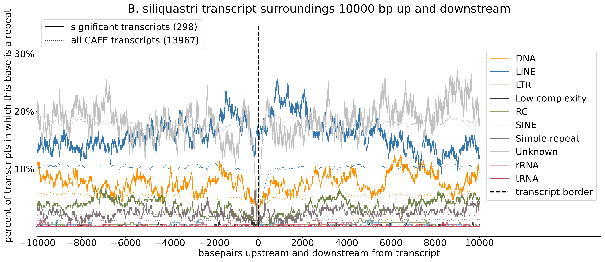
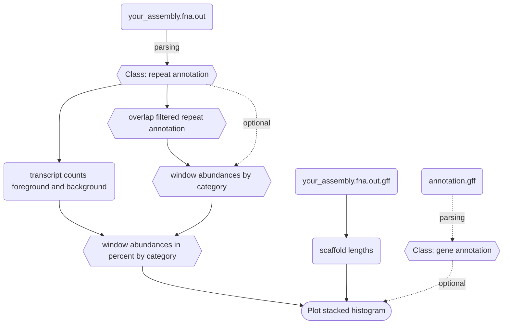
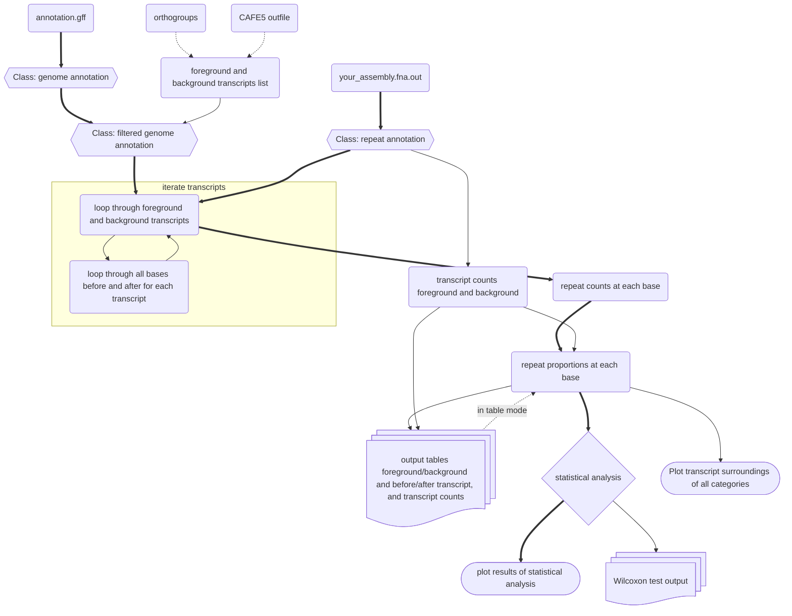

# ReVis

Visualize the output of repeatmasker. 

## Installation

Download the latest release and unzip it. You can just run the python script as described in quickstart below. You might have to install a few external dependencies manually (see [requirements.txt](src/ReVis/requirements.txt)) but they are all commonly used libraries easy to install with `pip`.

### Dependencies

 *  On uppmax, load biopython/1.80-py3.10.8 to use argparse (base python doesn't include it).
 *  libraries listed in [requirements.txt](src/ReVis/requirements.txt) (Sorry if I forgot any, I'm sure the compiler will tell you if you miss something)

# Run modes

You can make two different kinds of plots with ReVis: Genome wide repeat abundance histogram and a line plot showing the repeat abunance in the gene surroundings.

## Genome wide

You can show the repeat content across a genome in a stacked histogram of the different repeat categories. The windows are non-overlapping, and optionally a line of the gene numbers (mean over a specified multiple windows) can be included.

 

## Gene surroundings

It is also possible to look at the repeat landscape in the up and downstream sequence of specific genes. The repeat abundance is calculated for individual bases (not windows), the repeat content in the upstream and downstream regions of a list of "foreground" genes compared to a wider set of "background" to assess differences. 

 

### Statistical analysis

As part of the gene surroundings mode there is a statistical analysis to evaluate whether any repeat category is enriched in the foreground transcript surroundings compared to the background transcript surroundings. This can indicate that the repeat category in question is involved with the proliferation of the expanding gene families that make up the foreground transcripts. First, I run a wilcoxon test to see the significance in mean, and to increase indepencence of datapoints I downsample to 20 equidistant points before and after the transcript border. I test for all repeat categories seperately before and after the transcript and plot the p-values. 

<p float="left">
  
</p>

Since many repeat categories show a "curved" shape where the foreground line is higher closer to the transcript border but approaches the background line further away, I also perform polynomial regression and visually assess the 95% confidence interval. Since especially the foreground transcript line is very noisy, I have implemented two denoising methods, `--polreg_fourier_denoise` which does fourier denoising, and `--polreg_win_smooth int` is a sliding window approach where you specify the window length. (I recommend the fourier denoising, but in case that doesn't work the sliding window approach gives relatively similar results).


# ReVis Histograms (genome wide mode)

## Quick start

```bash
python3 ReVis.py \
    --masker_outfile your_assembly.fna.out \
    --masker_out_gff your_assembly.fna.out.gff \
    --out_dir ./ \
    --species_name Y_species \
    --window_length 1e6 \
    --plot_overlap_filtered \
    --verbose \
    --plot
```


(TODO: fix default for no given output directory! --> explicitly use `--out_dir ./` for now)

## how it works

<details>
<summary>Flowchart for ReVis whole genome mode</summary>




</details>

## Input options

Above are quickstart options, see all possible options with the `-h` flag or at the end of this documentation.

### Files

* Repeatmasker outfiles (do not change file extensions!!):
  * `your_assembly.fna.out`
  * `your_assembly.fna.out.gff`
* Optional:
  * genome annotation 1
  * genome annotation 2

(you do not need an assembly, the gff generated by repeatmasker contains ##sequence-region comments with the contig name and length)

### Parameters

* Species name (formatted like D_melanogaster for *Drosophila melanogaster*)
* window length (basepairs, can be in scientific notation like 1e6 for 1Mb)
* plot or table mode

# Documentation

download the latest release and just run `ReVis.py` like a normal python script. The dependencies are listed in `requirements.txt`, they are only commonly used python packages and can be installed with pip. 

The script is using the output files generated by repeatmasker, the masked assembly, and optionally one or two genome annotations based on the same assembly (contig names have to match!). Results can be plotted in a stacked histogram (plot mode) or returned as tsv files (table mode, requires the annotation!). 

Contigs are sorted by size decreasing in the plot.

### Overlapping repeat annotations

Repeatmasker allows overlapping repeat annotations. They say that this is to detect e.g. when one transposable element inserts itself into an already existing repeat. These overlaps can result in a repeat percentage of over 100% in a window. For plotting purposes, I have implemented a method of removing these overlaps. The overlap is filtered by cutting the beginning of the current repeat based on the end of the previous one. Below is a quick example of two repeat categories `-` and `*` that overlap in their annotated position, and how my script handles these overlaps

```
unfiltered overlapping repeats
--------------------        ----------------                                     -------------              
            *************************************               *************************

filtered repeats that do not overlap any more
--------------------*****************************               *************************-----
```

(Repeats completely inserted into other repeats that span a wider region are filtered out completely)

When I test filtering vs. no filtering on some species, the "shape" of the plots tends to stay the same, and the repeat proportions are similar to a certain extend. However, since some repeat categories are more prone to be completely inserted than others, this can change the proportions. If you want to run the overlap filtered version to avoid repeat abundances >>100%, you should also do a test run with unfiltered plotting to make sure that you are not greatly distorting the repeat proportions.

## Detailed description

This script analyzes repeatmasker output. You can run in two modes, plot mode or table mode. Plot mode returns 
a plot with a stacked histogram of all the repeat categories (overlap filtered! Repeat annotations can be on top of each other, 
where two or more repeats cover the same stretch of sequence, which can result in a >100% repeat coverage in some rep_windows. 
You can filter out repeat categories that overlap with others so that each base is only covered by one repeat annotation.
This filtering warps the category proportion in some windows, because it is likely that there are more bases of some categories 
removed than others. See get_repeat_abundance function documentation for details). If you include a genome annotation, 
a line for the number of annotated genes in the same windows is added. You can add up to two annotations to compare them.
Table mode returns the same by-window information as a tsv file with the proportion of basepairs in each window 
covered by each repeat category (NOT overlap filtered, so there can be more bp covered by all repeats in a window than the number
of masked bp or even the window length) and also the number of bp and ratio covered by coding regions (exons). If the masked
assembly is given it will also include the number of unmasked bp in each window.

The runtime depends on the overall repeat content and on how fragmented the assembly is. I have tried my best to optimize, 
but if your assembly is long and fragmented, it takes long to loop through many small contigs, and if there are many repeats, 
it takes long to sum all of them up per window. Short windows increase the total number of windows computed and plotted, 
which also increases the runtime. In any case, the longest runtime i managed to achieve with my data was 3:30 min.

### different possible input files

It takes as input two of the repeatmasker output files, `*.out` (but  `*.ori.out` also works), and `*.out.gff`. I have noticed that there
are some repeat categories that are missing from `*ori.out`, and I am unsure why. In my case it was specifically low complexity regions
that are in the repeatmasker `.tbl` summary and in `.out` but not in `ori.out`. My script can parse both, but double check which
one you want to use.

Good luck!

## Detailed flags
```
-h, --help            show this help message and exit
  --masker_outfile MASKER_OUTFILE
                        repeatmasker output file ending in .out 
  --masker_out_gff MASKER_OUT_GFF
                        repeatmasker output file ending in .out.gff
                            If not given it will be assumed to have the same basename as .out and inferred automatically.
                            (which is true if you didn't change anything about the repeatmasker outfile names.) 
                            (This technically contains the same information as the .out file, but it also has "sequence region" annotations
                            which have all the contig lengths. These would otherwise have to be extracted from the assembly and this is just faster.)
  --table               The output of the program is the tsv file with all values
  --plot                The output of the program is the plot
  --annotation_gff ANNOTATION_GFF
                        If you want to include a line that shows the gene density in each window, 
                            you can give an annotation based on the same assembly (with matching contig names!)
  --annotation_gff2 ANNOTATION_GFF2
                        You can include a second annotation as well if you want to and show to different lines.
  --gene_density        If you give an annotation, by default you will get the number of genes per window, 
                            but you may also calculate the ratio: number of genes / window length with this option
  --assembly_path ASSEMBLY_PATH
                        If you want to compute the table with all the per-window values you need to include the
                            masked assembly, so that the number of masked/unmasked bases can be computed properly. It should be the assembly that was masked in this repeatmasker
                            run and also the assembly that is the basis for the annotation
  --species_name SPECIES_NAME
                        species identifier string, like 'C_maculatus', '_' will be replaced with '. ' 
                            (Include this! If not included it will try to parse it automatically from the start of filenames, 
                            which will probably only work for how i named my files)
  --window_length WINDOW_LENGTH
                        window length (scientific notation like 1e6 is ok)
  --out_dir OUT_DIR     path to output directory. If not given all files will be saved in current working directory
  --merge_gene_windows MERGE_GENE_WINDOWS
                        If an annotation is included to show gene density, 
                            the gene density is likely difficult to interpret visually if you show it for each repeat-window.
                            Here you can choose how many windows you would like to average over, 
                            default = 5
                            put 1 if you don't want any averaging
  --plot_overlap_filtered
                        use the overlap-filtered repeats for plotting
  --plot_white_background
                        the plot does NOT have a transparent background, but white instead
  --verbose             print progress in the command line (recommended, on by default)
  --statistics          print contig-specific repeat statistics (optional, increases output length quite a bit, off by default)
                            Prints repeat information (and gene numbers if applicable) for each contig, mostly for debugging purposes
```

# Transcript Surroundings mode

Creates count tables of repeat presence per base in the transcript surroundings and then plots them. The tables can be generated based on orthofinder and CAFE output directly (`--compute_tables_from_OG`) or from lists of transcript IDs (`--compute_tables_from_list`). Also plots individual polynomial regressions for each repeat class with 95% confidence interval, data here can be smoothed with `--polreg_win_smooth` in either overlapping or nonoverlapping windows.

## Quick start
!! existing tables of the same name from previous runs will be overwritten

Generate the tables from orthofinder and CAFE5
```
python3 ReVis_transcript_surroundings.py \
  --compute_tables_from_OG \
  --out_dir ../../example_data \
  --masker_outfile ../../example_data/bruchidius_siliquastri_repeats.fna.out \
  --annotation_gff ../../example_data/bruchidius_siliquastri.gff \
  --orthogroups ../../example_data/N0.tsv \
  --CAFE5_results ../../example_data/CAFE5_Base_family_results.txt \
  --species_name B_siliquastri \
  --polreg_fourier_denoise \
  --bp 500 --GF_size_percentile 90 --verbose
```
```
python3 ReVis_transcript_surroundings.py \
    --compute_tables_from_list \
    --out_dir ../../example_data \
    --masker_outfile ../../example_data/bruchidius_siliquastri_repeats.fna.out \
    --annotation_gff ../../example_data/bruchidius_siliquastri.gff \
    --all_list ../../example_data/overlap_all_transcripts_B_siliquastri.txt \
    --sig_list ../../example_data/overlap_sig_transcripts_B_siliquastri.txt \
    --species_name B_siliquastri \
    --polreg_fourier_denoise \
    --bp 10000 \
    --GF_size_percentile 90 \
    --verbose
```

Plot already existing tables
```
python3 ReVis_transcript_surroundings.py \
  --plot \
  --out_dir ../../example_data \
  --all_before_table ../../example_data/B_siliquastri_cumulative_repeats_before_all_transcripts.txt \
  --sig_before_table ../../example_data/B_siliquastri_cumulative_repeats_before_sig_transcripts_90th_GF_size_percentile.txt \
  --all_after_table ../../example_data/B_siliquastri_cumulative_repeats_after_all_transcripts.txt \
  --sig_after_table ../../example_data/B_siliquastri_cumulative_repeats_after_sig_transcripts_90th_GF_size_percentile.txt \
  --num_transcripts ../../example_data/B_siliquastri_transcript_numbers.txt \
  --species_name B_siliquastri \ 
  --polreg_fourier_denoise \
  --verbose
```

## how it works 

<details>
<summary>Flowchart for ReVis transcript surroundings mode</summary>



</details>

## Summary

The data is generated and saved into four tables prior to plotting. Each table has a row for each repeat category, and each column is one base. The number in the cell is how often this base position is annotated with a repeat of one category in all the transcripts considered. It also generates a file where it saves the number of transcripts considered for foreground and background respectively, so that the repeat counts from the tables can be normalized into a percentage for comparability. The repeats are _not_ overlap filtered the way they can be for the whole genome histogram since that would distort the statistical analysis.

Since I get the foreground and background transcripts from orthofinder and CAFE analysis of a set of species, these are the data structures that I have tested this code with the most. This is also why they are mostly refered to as "sig" (significant) for the foreground transcripts and "all" for the background transcripts. I did try to implement an option where you can pass lists of transcript IDs (corresponding to your annotation) in the command line directly for the foreground and background transcripts, if you are not using orthofinder/cafe, but I didn't exactly test it rigorously so it may not work.

ReVis_transcript_surroundings.py comptues four tables:
* foreground transcripts sequences:
    * before transcript start
    * after transcript start
* background transcripts sequences:
    * before transcript start
    * after transcript start

and one file that contains the number of transcripts used to calculate the foreground and background tables, to use for calculating the percentages when plotting

You can specify how many bp up and downstream from a transcript border you want to check (default 500). This is not a fast program, so I have found that 10k bp is a nice compromise of seeing interesting dynamics and it not taking too long. The test plot with *B. siliquastri* took less than 10 mins for 10k bp, but more repeat rich genomes will take longer, as will longer foreground and background lists. When I run it with a different species that has a 1 Gb genome, 70% repeats and I set 10 kb up and downstream it takes almost two hours.

You can pass these parameters
* `bp` (how many bp up- and downstream of a transcript to compute and plot)
* `gene family size percentile` (recommended! for the sig. table, only genes that are part of actually expanding gene families (whose size is in the upper nth size percentile, not just all sig. evolving orthogroups, are included)
* If you are doing orthofinder/CAFE: `species name` must match one in the orthofinder output!!!

```
options:
    -h, --help            show this help message and exit
  --compute_tables_from_OG
                        it will compute all the tables required for plotting and then also make the plot
  --plot                it will ONLY plot and you have to pass the table filepaths as input (if you go more than 1kb up/downstream, computing the tables will take a long time)
  --compute_tables_from_list
                        it will compute all the tables from two lists of transcript IDs, a foreground and a background list (or a 'significant' and 'all' list respectively)
  --out_dir OUT_DIR     path to output directory. If not given all files will be saved in current working directory
  --masker_outfile MASKER_OUTFILE
                        repeatmasker output file ending in .out
  --annotation_gff ANNOTATION_GFF
                        genome annotation based on the same assembly as the repeatmasker output
  --orthogroups ORTHOGROUPS
                        hierarchical orthogroups file computed by orthofinder (N0.tsv) matching the results from CAFE5
  --CAFE5_results CAFE5_RESULTS
                        family_results.txt file from CAFE5 with orthogroup names matching the orthofinder output
  --all_list ALL_LIST   path to csv file containing a list of gene or transcript IDs from annotation_gff to be used in the all table (background table).
  --sig_list SIG_LIST   path to csv file containing a list of gene or transcript IDs from annotation_gff to be used in the sig table (foreground table).
  --all_before_table ALL_BEFORE_TABLE
                        when only plotting: table with background repeat abundance before genes ('all' genes)
  --all_after_table ALL_AFTER_TABLE
                        when only plotting: table with background repeat abundance after genes ('all' genes)
  --sig_before_table SIG_BEFORE_TABLE
                        when only plotting: table with foreground repeat abundance before genes ('significant' genes)
  --sig_after_table SIG_AFTER_TABLE
                        when only plotting: table with foreground repeat abundance after genes ('significant' genes)
  --num_transcripts NUM_TRANSCRIPTS
                        when only plotting: file containing the number of genes/transcripts used to compute the foreground and background tables (to be able to calculate proportion)
  --species_name SPECIES_NAME
                        species identifier string, MUST match one species name in the orthofinder output
  --bp BP               how many bp up and downstream of the transcript borders should be included. Default is 500 for testing purposes, but to see patterns you should use at least 5kbp
  --GF_size_percentile GF_SIZE_PERCENTILE
                        only gene families in the upper nth percentile of gene family size areincluded in the significant gene families. DOES NOT APPLY TO COMPUTE_TABLES_FROM_LIST! This helps ensure that only gene families that are really expandingin species_name specifically are included, and not the ones that are significant because they are expanding in other species.The default is 90 percent, which includes almost all gene families except the ones with only 1 or 0 members in most cases
  --nonoverlapping_windows
                        nonoverlapping windows in the plots that calculate a ploynomial regression with confidence interval for the repeat classes
  --overlapping_windows
                        overlapping windows in the plots that calculate a ploynomial regression with confidence interval for the repeat classes
  --polreg_win_smooth POLREG_WIN_SMOOTH
                        for the polynomial regression, how long should the windows for the smoothing be. If you don't want any windows or fourier denoising, put 1 (for 1 bp windows)
  --polreg_fourier_denoise
                        for the polynomial regression, use fourier transformation to smooth out the noise (mutually exclusive with window length)
  --plot_white_background
                        the plot does NOT have a transparent background, but white instead
  --plot_no_legend      the plot does NOT include a legend with the colors for all the repeat categories
  --verbose             print progress in the command line (recommended, on by default)
  ```
